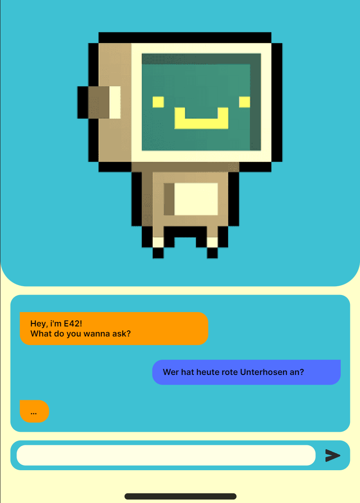

# Smartnau

---
## Idee
Smartnau ist ein Begrüßungsbot, welches über eine App Nachrichten auf einem Bildschirm in der Finkenau schicken kann. Der Begrüßungsbot selbst soll über Zustände im Form von Pixelbilder visualisiert werden. Die Anwesenden an der Finkenau können über zwei Buttons auf die Nachrichten anworten. Aktuelle Zustände in der Finkenau sollen mit der App synchronisiert werden. App-Nutzer sollen in der Lage sein die Zustände des Begrüßungsbots zu ändern. 

---

## Nice-to-have
- MAC-Adressen in einem Raum in eine Datenbank speichern, um alle Anwesenden in einem Raum abzuzählen
- Statusanzeige, ob ein Raum voll ist oder nicht. (Grün oder Rot)

---
## MQTT Kanaele

Sub message : String  
Pub message : String  

Sub message_date : String  
Pub message_date : String  

Sub message_time : String  
Pub message_time : String  

Sub UUID : String  
Pub UUID : String  

Sub button, state : byte  
Pub button, state : byte  

---

